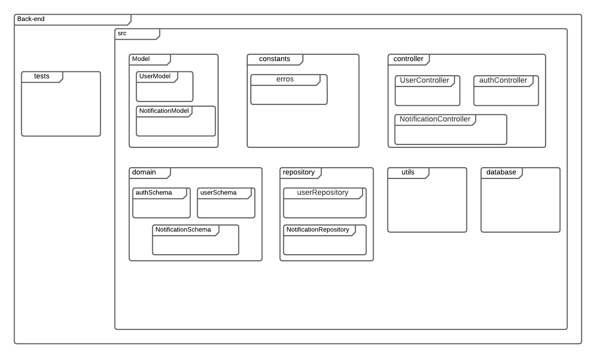
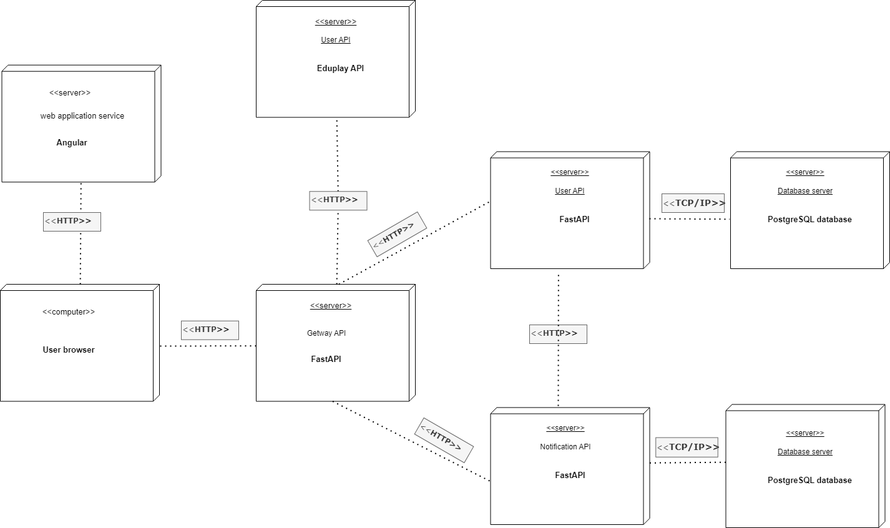
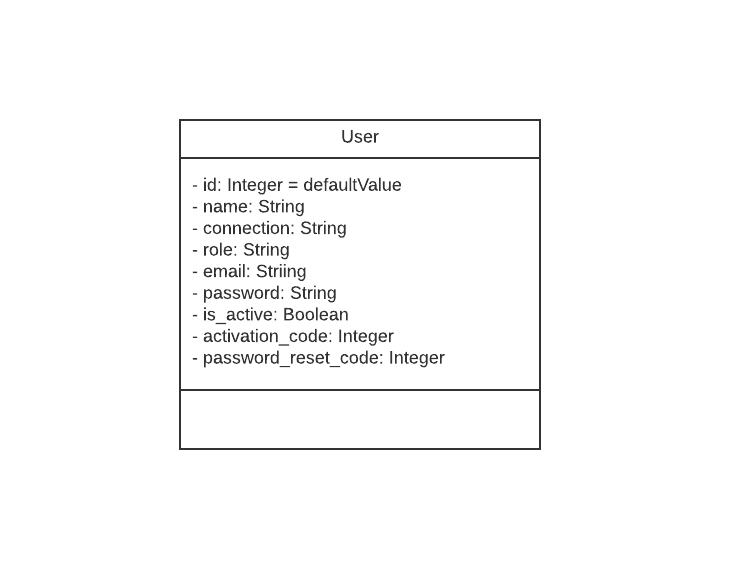

# Documento de Arquitetura

## 1. Introdução

O documento de arquitetura tem por finalidade apresentar e justificar as decisões tomadas em relação à implementação do sistema de software, abrangendo aspectos como o banco de dados, o backend, o frontend e as interações com outros sistemas.

## 1.1. Visão Geral

Este documento está estruturado da seguinte forma: - Introdução - Representação arquitetural - Visão lógica - Referências bibliográficas - Histórico de versão

# 2. Representação arquitetural

## 2.1. Diagrama de Relações

O Diagrama de Relações é uma representação gráfica que ilustra como os componentes do sistema se comunicam e interagem. Nesse tipo de diagrama, você pode destacar as conexões e dependências entre os diferentes microserviços, o frontend e o backend do sistema. Isso ajuda a visualizar a arquitetura de software e entender como as partes se relacionam.

O estilo arquitetural apresentado acima, adota uma abordagem em que uma aplicação é dividida em unidades menores, chamadas de microsserviços, que funcionam de maneira autônoma com baixo acoplamento. Esses microsserviços podem interagir entre si geralmente por meio de APIs e são organizados com base em funções de negócios específicas.

## 2.2. Representação dos serviços

Ao criar um diagrama de relações de um sistema, é importante fornecer detalhes suficientes para representar com precisão a arquitetura do sistema e como os diferentes componentes se conectam.

-   Frontend: Representação da interface do usuário, como páginas da web, aplicativos móveis ou qualquer outra forma de interação com o usuário.

-   Backend: Representado pelos servidores, aplicativos e serviços que processam solicitações vindas do frontend, realizam lógica de negócios e interagem com o banco de dados.

-   Microserviços: Cada microserviço é representado separadamente no diagrama, destacando as funções específicas que eles desempenham.

-   Comunicações: As setas e linhas conectando os elementos indicam as interações e comunicações entre o frontend, o backend e os microserviços.

-   Gateway: Responsável para realizar a interface do usuário com os demais serviços da aplicação, provendo autenticação e autorização.

-   Usuário: Serviço de usuário é responsável por gerenciar os usuários da aplicação.

-   EduPlay: Serviço de stream responsável por gerenciar os videos da aplicação.

-   Notificação: Serviço de notificação é responsável por gerenciar os notificações da aplicação.

## 3. Tecnologias

### 3.1. Angular

Angular é um framework JavaScript de código aberto que dispoe de uma estrutura de desenvolvimento web que se destaca por sua abordagem baseada em componentes. Ele oferece a capacidade de criar componentes encapsulados e autossuficientes que gerenciam seu próprio estado, permitindo assim o desenvolvimento de interfaces de usuário complexas. Angular é uma escolha sólida para o desenvolvimento front-end, pois fornece ferramentas e recursos para construir aplicativos web interativos e escaláveis.

### 3.2. FastAPI

O FastAPI é um framework Python que brilha no desenvolvimento de APIs RESTful e aplicações web, semelhante ao ao Angular, porém, focado no back-end. Com uma sintaxe limpa e intuitiva, o FastAPI permite a criação de endpoints encapsulados, tornando o processo de desenvolvimento eficiente e produtivo. Sua capacidade de geração automática de documentação Swagger e suporte a tipagem de dados em Python com Pydantic facilitam a criação de APIs robustas e bem documentadas. O FastAPI é uma escolha sólida para o desenvolvimento back-end.

### 3.3. PostgreSQL

O PostgreSQL é um sistema gerenciador de banco de dados relacionais de código aberto que permite o armazenamento, recuperação e gerenciamento eficiente de dados estruturados. O PostgreSQL será utilizado para gerenciar as bases de dados dos serviços da aplicação.

## 4. Visão lógica

### 4.1. Diagrama de pacote Front-end

### 4.2. Diagrama de pacote Back-end

### 4.3. Diagrama de implantação

### 4.4. Diagrama de classe

#### 4.4.1. Microsserviço de usuário

## 5. Referências Bibliográficas

CREATELY. O Guia Fácil de Diagramas de Implantação UML. Disponível em: https://creately.com/blog/pt/diagrama/tutorial-do-diagrama-de-implantacao.

Geekhunter. O que são microsserviços e como funcionam?. Disponível em: https://blog.geekhunter.com.br/arquitetura-de-microsservicos-x-arquitetura-monolitica/.

## 6. Histórico de versão

| **Data**   | **Descrição**                                    | **Autore(es)**    |
| ---------- | ------------------------------------------------ | ----------------- |
| 22/10/2023 | Adição do documento                              | Sávio             |
| 22/10/2023 | Adiciona diagrama de classes e demais alterações | Gabrielle Ribeiro |
