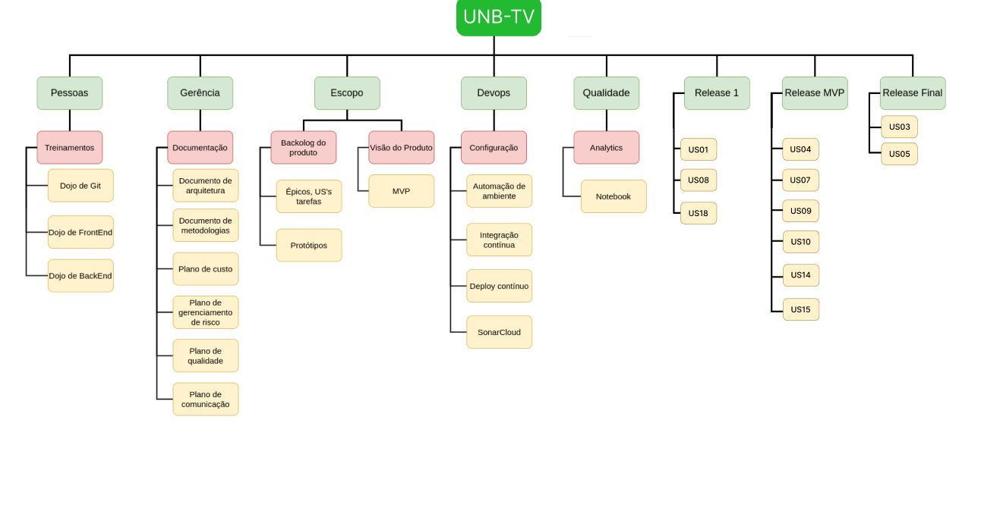

# Estrutura Analítica do Projeto (EAP)

## 1. Introdução

Conforme explicado no Guia PMBOK, a Estrutura Analítica do Projeto (EAP) é uma ferramenta que permite a decomposição do escopo total do trabalho que a equipe do projeto precisa realizar para atingir os objetivos do projeto e produzir as entregas solicitadas. Assim, a EAP serve para organizar e definir de forma clara o escopo total do projeto aprovado.

Dentro da EAP, o trabalho planejado é detalhado no nível mais baixo, conhecido como pacotes de trabalho. Estes pacotes de trabalho são utilizados para agrupar atividades, facilitando o agendamento, a estimativa, o monitoramento e o controle do trabalho. No âmbito da EAP, o termo "trabalho" refere-se às entregas que são os resultados concretos das atividades realizadas.

## 2. EAP

A imagem 1 abaixo mostra a EAP para o projeto UNB-TV.

## 3. Referências

> [1] Guia PMBOK 6a. ed. EUA: Project Management Institure, 2017. Disponível em: http://www.sesp.mt.gov.br/documents/4713378/12273418/Guia-PMBOK+6%C2%AA+Edi%C3%A7%C3%A3o_compressed.pdf/cd4313d8-a65c-e146-3a24-505a6bc29d4b

> [2] EQUIPE ALECTRION 2023-1. Estrutura Analítica do Projeto (EAP). Disponível em: https://fga-eps-mds.github.io/2023-1-Alectrion-DOC/documentacao/eap/

## 4. Histórico de versão

|**Data**|**Descrição**|**Autor(es)**|
|--------|-------------|--------------|
|9/12/2023| Adição do documento | Geraldo Victor |
