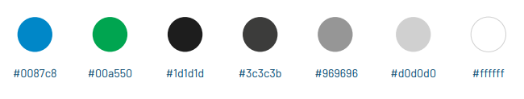
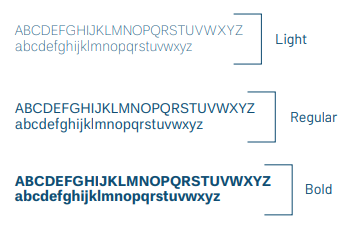

# Guia de Estilo

Um guia de estilo é um documento que tem como principal objetivo apresentar de maneira clara e concisa as diretrizes gerais de design de um projeto, incluindo elementos como fontes, cores e outros aspectos relevantes.

Este guia de estilo segue as diretrizes fornecidas pela Universidade de Brasília (UnB) em seus próprios projetos.

## Elementos

### Cores

### Icones

### Tipografia

| Data       | Versão | Descrição             | Autor            |
|------------|--------|-----------------------|------------------|
| 22/10/2023 | 1.0    | Documento inicial     | Ricardo Loureiro |